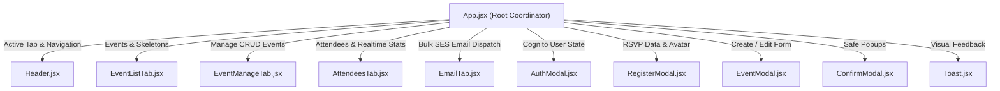

# Frontend Architecture & Component Structure Guide 💻

Tài liệu này mô tả chi tiết kiến trúc tầng giao diện **React (Vite + Tailwind CSS)** của hệ thống **AWS Cloud Events & RSVP Platform**.

---

## 1. Cây Cấu trúc Thư mục Frontend (`source.awscloud.fe/src`)

```
source.awscloud.fe/src/
├── components/
│   ├── common/
│   │   ├── Header.jsx          # Thanh điều hướng trên cùng, logo, profile Cognito & mobile nav
│   │   ├── Toast.jsx           # Hệ thống thông báo nổi (Alert, Info, Success) tối ưu cảm ứng
│   │   └── ConfirmModal.jsx    # Hộp thoại xác nhận đa năng (Xóa sự kiện, Đăng xuất, Review RSVP)
│   ├── events/
│   │   ├── EventListTab.jsx    # Tab 1: Khám phá sự kiện, Skeleton loading, Đăng ký nhanh
│   │   ├── EventManageTab.jsx  # Tab 2: Quản lý CRUD sự kiện
│   │   └── EventModal.jsx      # Modal Tạo / Chỉnh sửa sự kiện + Upload Banner lên S3 (<=2MB)
│   ├── attendees/
│   │   ├── AttendeesTab.jsx    # Tab 3: Danh sách người tham gia, Metric Cards, Bộ lọc Yes/No
│   │   └── RegisterModal.jsx   # Modal Form Đăng ký tham gia + Upload Avatar lên S3 (<=2MB)
│   ├── email/
│   │   ├── EmailTab.jsx        # Tab 4: Gửi Email hàng loạt SES + Ràng buộc chọn Sự kiện
│   │   └── EmailPreview.jsx    # Hộp xem trước trực quan (Live HTML Preview) của Email SES
│   ├── auth/
│   │   └── AuthModal.jsx       # Modal Đăng nhập, Đăng ký (Checklist mật khẩu) & Xác thực OTP
│   ├── CustomSelect.jsx        # Component Dropdown phong cách Shadcn UI, hỗ trợ click outside
│   └── EmailChipInput.jsx      # Component nhập Email dạng Tag/Chip (RFC regex & ngăn trùng lặp)
├── api.js                      # Axios/Fetch API client kết nối Backend Express & Lambda
├── App.jsx                     # State Coordinator & Router điều phối toàn bộ ứng dụng
├── main.jsx                    # Entry point React với BrowserRouter
├── index.css                   # Tailwind Base, Custom Scrollbars, Glassmorphism utilities
└── package.json
```

---

## 2. Các Quy chuẩn Thiết kế & UI Tokens (Design System)

| Thành phần | Quy chuẩn Class Tailwind | Mô tả |
|---|---|---|
| **Dark Theme Base** | `bg-zinc-950 text-zinc-100` | Nền tối sâu chuyên nghiệp, giảm mỏi mắt |
| **Primary Buttons** | `bg-blue-600 hover:bg-blue-500 text-white shadow-md shadow-blue-950/50 border border-blue-500/50` | Nút hành động màu xanh Blue đậm nổi bật, rõ trạng thái Active |
| **Special Action (Send Email)** | `bg-gradient-to-r from-blue-700 via-blue-600 to-indigo-700` | Gradient tạo điểm nhấn cho tính năng gửi email hàng loạt qua SES |
| **Active Tabs & Badges** | `bg-blue-600 text-white shadow-sm border border-blue-500/50` | Nhận diện tab đang được chọn tức thì |
| **File Upload Boxes** | `border-dashed border-zinc-800 hover:border-blue-500/60` | Drag/drop & file picker khu vực rõ ràng |
| **Danger Actions** | `bg-red-600 hover:bg-red-500 text-white` | Áp dụng cho nút Xóa sự kiện và Đăng xuất |

---

## 3. Luồng Quản lý Dữ liệu & State Flow



---

## 4. Kiểm thử Build
- Chạy lệnh kiểm tra tính toàn vẹn: `npm run build`
- Kết quả: Build thành công 100% không cảnh báo lỗi cú pháp.
